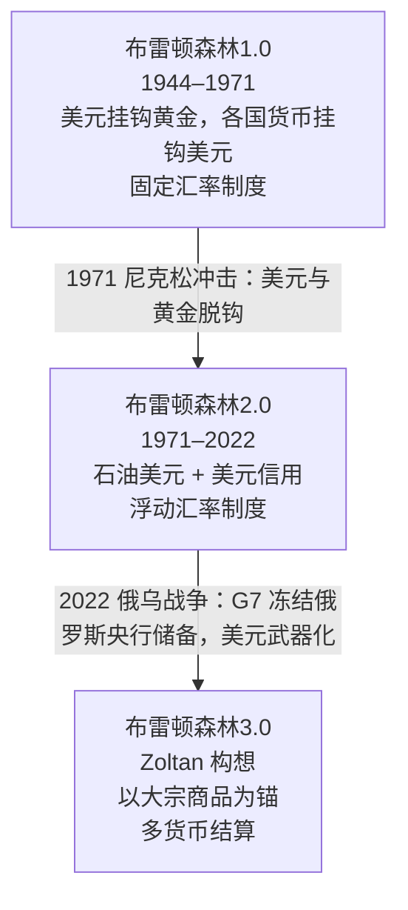
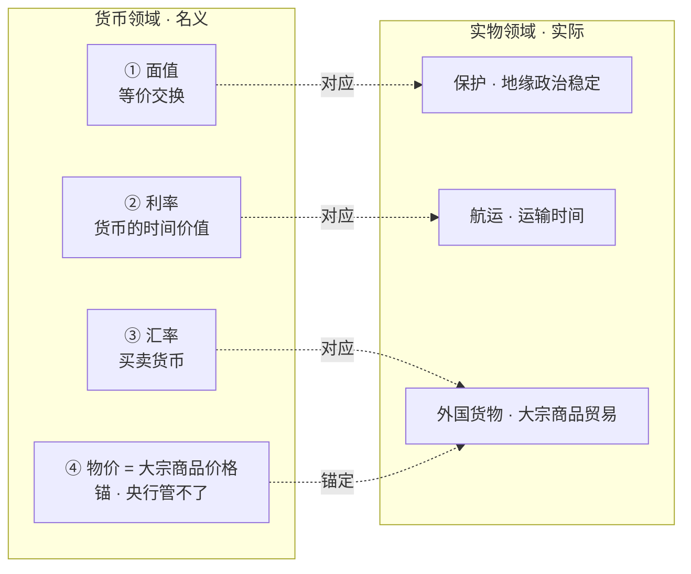

# 布雷顿森林体系3.0：Zoltan Pozsar 的全球货币秩序新叙事

> 来源：[看懂全球经济变局：Zoltan Pozsar《布雷顿森林体系3.0》系列报告完整梳理](https://mp.weixin.qq.com/s/gyhn_B2hNbVRsmfnPO6NVg)（公众号：古登堡1492，原文整理自 2023 年）

## 1. 一句话总结

俄乌战争后，前美联储/瑞信经济学家 Zoltan Pozsar 抛出一个大胆判断：**以美元信用为锚的旧国际货币体系（布雷顿森林体系2.0）正在瓦解，一个新的以“大宗商品”为锚的东方货币秩序（布雷顿森林体系3.0）正在诞生**。

**一个比喻**：旧世界像“美元当房东”——全球都得住美元的房子、交美元的租（用美元买计价的石油和商品）。新世界里房东换人了，换成手里攥着石油、粮食、金属的人；你要买他们的货，就得按他们的规矩付钱（人民币、卢布、迪拉姆）。“我们的货币，你们的问题”，正在变成“我们的大宗商品，你们的问题”。

## 2. 背景：Zoltan Pozsar 是谁

- 前美联储、IMF、美国财政部官员，离职前是瑞信全球短期利率策略主管，全球最负盛名的影子银行与货币流动性研究专家。
- 早年《Global Money Note》《Shadow Banking》等研究偏艰深；真正“破圈”的是俄乌冲突后发表的**布雷顿森林体系3.0系列报告**（2022年3月—2023年1月，共 8 篇）。
- 系列观点事后**部分被证伪**（Zoltan 自己承认）、部分被证实、部分仍无定论——但它的**思考框架**（把地缘政治、战争、大宗商品塞回货币分析）被认为很有价值。

## 3. 布雷顿森林体系演进：1.0 → 2.0 → 3.0

- **1.0**：美元与黄金挂钩，其他货币与美元挂钩的固定汇率制（1944，二战结束）。1971 年“尼克松冲击”终结。
- **2.0**：美元改挂石油（石油美元），靠美国信用支撑的浮动汇率制。外围国家盯住美元搞出口导向，积攒的美元储备回流买美债，压低美国融资成本。
- **3.0**（Zoltan 设想）：以大宗商品（石油/粮食/金属）为锚、人民币等东方货币参与结算的新秩序。判断依据：俄乌战争冻结俄罗斯储备 → 各国意识到“美元储备可以被没收”→ 信用货币（内生货币）的吸引力下降，实物资产（外生货币）吸引力上升。

## 4. 核心概念：Outside Money vs Inside Money

**一句话**：外生货币是“不欠任何人的东西”，内生货币是“有人欠你的借条”。**比喻**：内生货币像借条，值钱靠的是某个机构承诺兑付（央行、银行）；外生货币像真金白银，本身就有价值，不需要谁承诺。

- **外生货币（Outside Money）**：不属于任何人的债务——黄金、比特币、大宗商品。
- **内生货币（Inside Money）**：属于某机构债务——法币（央行负债）、银行存款（银行负债）、货基份额。

Zoltan 认为战争让“外生货币”重新吃香，因为它的价值不靠任何一个发行者的信用和承诺。

## 5. 货币的四种价格（Perry Mehrling 框架）

**一句话**：货币有四种价格，其中只有“物价”（大宗商品价格）央行管不了。**比喻**：前三种像水龙头的阀门，央行能拧大拧小；第四种像天上下雨，央行只能看着，没法拦。

货币有 4 种价格，每一次大危机都是其中一种出了问题：

| 货币价格 | 对应 | 央行能干预吗 |
|---|---|---|
| ① 面值 | 货币间的等价交换 | ✅ |
| ② 利率 | 货币未来的价格 | ✅ |
| ③ 汇率 | 外国货币的价格 | ✅ |
| ④ 物价 | 大宗商品价格 | ❌ **不能** |

关键金句：**“You can print money, but not oil to heat or wheat to eat”——你可以印钱，但印不出取暖的石油和吃的粮食。** 所以大宗商品驱动的通胀，QE 治不了，只能靠加息硬压，代价是经济。

## 6. 系列报告时间线（8 篇）

### 《布雷顿森林体系3.0》2022-03-07（开山之作）
“我们正在见证一种**东方的、以大宗商品为锚的新国际货币秩序**的诞生，这可能会削弱欧洲美元体系，并加大西方通胀压力。”核心机制：俄乌战争 → 俄罗斯大宗商品“下线”，价格剧烈分化（俄货暴跌、非俄货暴涨）→ 类似 2008 年的 CDO vs 国债，两边都需要追加保证金 → “大宗商品基差”扩大，资金越紧张危机越深。结论：只有中国央行有能力抹平大宗商品价差（卖美债清仓俄商品 / 或本币 QE 买俄商品推进人民币国际化）。

### 《货币、大宗商品与布雷顿森林体系3.0》2022-03-31（四价四柱）
把“四价”拓展到实物世界，形成“四价四柱”：三种名义价格各对应一个实物支柱，物价=大宗商品价格居中作锚。

要点：
- 过去大宗商品**需求方**（西方）主导支付货币（美元）；现在**供应商**（东方）开始主导——俄罗斯对“非友好”国家要卢布结算，沙特对中国用人民币开放态度。
- 航运=时间=钱：运输线路被迫拉长（如绕路），船舶短缺 → “We can't QE oil or VLCCs”（印不出油也印不出船）。
- 保护=面值：霍尔木兹海峡、海盗、保险费上涨 → 过境贵、货物贵、风险溢价上升。
- 简化版是一个**三角形**：物价稳定居中，金融稳定与地缘政治稳定分列两极。BW2.0 带来通缩（全球化、just-in-time），BW3.0 带来滞胀（去全球化、just-in-case、低效供应链）。

### 《美元大空头 The Big $hort》2022-04-12
人民币、大宗商品、黄金等储备资产崛起 → 终结美元主导和“过度特权”。新三位一体是“**我们的大宗商品，你们的问题**”。用 1992 年英镑危机（英格兰银行无力跟随德国加息）类比：今天的风险不是新兴市场货币贬值，而是**固定汇率国家不愿追随美联储加息、重新寻锚**（货币升值是强国战略）。回顾 1997/2008/2019 三次影子银行危机共同模式：流动性断裂 → 花钱兜底 → 长期影响。第四次是“大宗商品交易缺流动性”，而**保证大宗商品价格稳定的应是交易商而非央行**。

### 《战争与利率 War and Interest Rates》2022-08-01
“War is inflationary”（战争自带通胀属性）。低通胀世界的三大支柱正在瓦解：廉价移民劳动力、中国廉价产品、俄罗斯廉价天然气。通胀要从“周期性”（疫情+刺激）理解改为“**结构性**”（经济战、地缘政治）理解。要看通胀，少读弗里德曼，多读**布热津斯基和麦金德**（地缘政治）。美联储不是“加息周期”，而是“**结构性紧缩**”；经济要 L 型调整（深度衰退 + 长期停滞）才能压住通胀，鲍威尔会走沃尔克的路——**宁可衰退，不可毁掉央行信誉**。

### 《战争与产业政策 War and Industrial Policy》2022-08-24
全球化只在和平期运转。两个旧合作体系瓦解：**Chimerica**（中美）与 **Eurussia**（俄欧）；取而代之的是**Chiussia**（中俄）——“全球最大资源输出国 × 世界工厂”的联姻，可能控制欧亚大陆。被制裁经济体组成 **TRICKs**（Turkey、Russia、Iran、China、Korea）。供应链将迎来“**明斯基时刻**”（库存之于供应链 = 流动性之于银行）。西方应对 = 四类产业政策：**①国防开支 ②制造业回岸 ③补库存 ④重建电网**，特性：商品密集、资本密集、对利率不敏感、投资性减弱。

### 《战争与商品权力负担 War and Commodity Encumbrance》2022-12-27
“国家元首比央行行长更重要。”重头戏是**石油人民币的黎明**：中海/中阿峰会 → 上海油气交易中心人民币结算 → 多边央行数字货币桥（m-CBDC Bridge，不涉及美元/代理行网络）。**权力负担（encumbrance）**：**一句话**——货被抵押锁死后，市面上就变少，想买的人只能加价。**比喻**：大宗商品像被“独家包销”的货，东方国家把它押住，西方想买就得加价，通胀就被顶上去。简单讲：大宗商品当作抵押品，被东方“押注”后变稀缺 → 西方低价买不到 → 通胀抬升。中国对 OPEC+ 的布局：俄罗斯/伊朗/委内瑞拉（约占探明储量 40%）已用人民币折价售油；海合会（另 40%）被以“投资换结算”争取。比喻“**农场到餐桌**”：以前卖鸡肉蔬菜给你，现在我自己炖汤，你只能进口罐头——“我们的大宗商品，我们的解放”。伴随“金砖国家货币”（商品加权中立储备资产）的构想。

### 《战争与货币治理 War and Currency Statecraft》2022-12-29
世界从单极走向多极：“一个世界，两个体系”（G7+澳大利亚 vs 金砖+ / 不结盟）。引布热津斯基（欧亚大陆是棋盘）与麦金德（**谁控制大宗商品和工厂，谁控制通胀；谁控制通胀，谁控制利率；谁控制利率，谁控制金融市场**）。去美元化加速：盈余国不再买美债，转而相互资助（俄罗斯援土耳其、中国援俄、沙特援埃及）。中国央行正扮演比美联储**地理上更多元化的“国际最后贷款人”**：美联储的互换是“维护过去”（给既有盈余兜底），中国的互换是“承保未来”（给未来贸易融资）。**CBDC 像野葛**，金砖央行借 m-CBDC Bridge 织网替代美元代理行体系——Zoltan 劝美联储**别推自己的 CBDC**（别拆自己传了美元几十年的网络）。结尾金句：“世界正在一分为二，货币体系亦是如此，**美元来到了十字路口**。”

### 《战争与和平 War and Peace》2023-01-06（最终章）
战争以各种形态定义了 2019 年以来每一年的宏观主题。2022 年“六条战线”（热战）：G7 金融封锁俄、俄能源封锁欧、美科技封锁中、中海上封锁台、美国《通胀削减法案》封锁欧洲电动车、中国+OPEC+ 让油气用人民币计价。**多重危机（Polycrisis）**= 货币四种价格同时危机，根源是物价（通胀）危机。美国国债面临“没人买”的将死之局 → 美联储的“看跌期权”已死（不救风险资产），但**政府债券看跌期权万岁**（国债市场失灵时央行必须出手）。投资建议：
- 60/40 股债组合过时，改为 **20/40/20/20**（现金/股票/债券/商品）；
- 收益率倒挂时**现金为王**（“现金是看涨期权”——巴菲特）；
- 商品看“三色金”：黄金、黑金（石油）、白金（锂）+ 铜钴；
- 美元霸权**不会立刻衰落**，但去美元化 + 金砖 CBDC 会逐渐侵蚀。

## 7. Zoltan vs Perry Mehrling：美元会衰落吗？

2022 年 9 月二人在播客对谈，立场鲜明对立：

| 议题 | Zoltan Pozsar | Perry Mehrling（波士顿大学） |
|---|---|---|
| 是否已身处 BW3.0 | 已身处：多货币定价大宗商品、G7 通胀失控、各国转向商品储备 | 没到拐点：美元体系依然高效，是“全球公共品” |
| 美元前景 | 对其他货币强、对**大宗商品**贬；通胀是 70 年代以来最严重，危机逼近 | 高通胀是疫情资源错配，鲍威尔会像 2018 年一样果断，**支撑美元** |
| 美债需求 | 问题不是流动性，是**美债没人要**（缩表空间不大） | 美元仍被主动使用，各国配合美联储，未来可走“后疫情马歇尔计划”放水 |

## 8. 质疑与争议

1. **工业品本位不可行**：让人民币锚定一篮子大宗商品（如乌拉尔原油）风险极大——油价波动剧烈，锚定商品会让汇率像商品货币一样脆弱，还可能触发本币信心崩塌。且 ESG 转型下，原油是“黄昏资产”，不适合当锚。
2. **人民币回流机制不完善**：人民币国际化要“出得去、回得来”。目前资本账户开放、国债市场深度和流动性都不够，海外央行没有动力大量增持人民币资产。没有捷径。
3. **“资源国×制造国”联盟是否伪命题**：中国自身也是巨大的商品**消费国**，欧美也有制造业和资源。双输局面下，比的不是谁更“不可替代”，而是**谁更有韧性**。
4. **硬脱钩 vs 产业重构**：更可能的是产业层面的重构，而非全方位的“你死我活”。主动切断贸易对挑战者同样危险。

## 9. 参考资料（原文列出的部分）

- 《Bretton Woods III》《Money, Commodities, and Bretton Woods III》《The “G-SIB” of Commodities》《The Big $hort》《War and Interest Rates》《War and Industrial Policy》《War and Commodity Encumbrance》《War and Currency Statecraft》《War and Peace》，Zoltan Pozsar（瑞信）
- 《劝君慎读Zoltan：经济秩序重构的迷思》《布雷顿森林体系III真会到来吗？人民币如何成为全球货币新秩序的基础？》等中文评论
