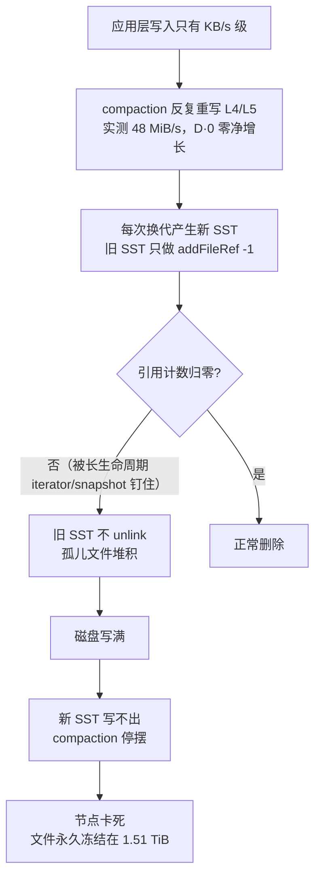

# bityuan 全节点磁盘写满：goleveldb 孤儿文件堆积

> 一句话：升级到 v6.9.0 后节点磁盘被写满、进程卡死，但**数据并没有变多**——盘上 1.51 TiB 里只有 604 GiB 是活数据，另外约 **1 TB 是 leveldb 换代后从没被删除的旧文件（孤儿 SST）**。恢复方法很简单：**正常重启一次**，引擎在打开数据库时会自动把它们清掉。**9/22 晚已在生产上验证：重启后 `.ldb` 946,406 → 385,800，`/data` 从 100% 回到 52%，回收约 1 TB。**
>
> ⚠️ **但根因仍未定位**。目前能证明的只是机制层的一句话——孤儿文件**只在打开数据库时被清、运行期不清**（`checkAndCleanFiles()` 只在 `Open` 路径里调用）。**为什么会产生这么多孤儿**（正常换代本该把旧文件删掉）**至今没有查清**。所以：**重启是止血，不是修复**，过一阵还会再堆，只能靠定期体检 + 滚动重启兜着。详见文末「悬而未决」。

## 先给直觉（比喻）

把 leveldb 想成一个不停重排书架的图书馆。**compaction** 就是把几排书架的书抄到新书架上、再撤掉旧书架。这台节点出了两个问题：

1. **它每 2.5 小时把同一层书架整层重抄一遍**（实测 48 MiB/s），而这期间**一个字节的新书都没添**（compaction 日志里 `D·0` = 没丢任何 key，版本总大小恒定 604 GiB）——纯重写、零净增长；
2. **抄完的旧书架不撤**。撤书架要等“没有读者还在借这一版”（引用计数归零），而现场存在**长生命周期的读者**把它钉住（未实锤），于是旧书架只增不减。

结果：仓库被旧书架塞满 → 连“抄书”都写不下了 → 整个图书馆停摆。**磁盘满是结果，不是原因。**

## 现场与症状

| 项 | 值 |
|---|---|
| 主机 | 某线上全节点（主机名略去，本文档公开） |
| 磁盘 | `/dev/nvme0n1 1.8T 已用 1.8T 0 可用 100% /data` |
| 进程 | **已停**（写路径上卡死，应用日志一行报错都没留下就断了） |
| 版本 | v6.9.0：二进制 9/18 15:33 落盘，**9/21 16:25 切换运行**（前版 6.8.22） |
| 关键现象 | 升级后写入量从 1–2.8 GB/天 升到 4–7.4 GB/天，9/21 起指数失控，最高 **91 GB/h**（即“2 小时 80G”的来源） |

空间去向（`du -sh datadir/*`）：

| 路径 | 大小 | 说明 |
|---|---|---|
| `datadir/blockchain.db` | **1.51 TiB** | ★ 名义值；其中 **604 GiB 活数据 + ≈1 TB 孤儿文件** |
| `datadir/p2pstore.db` | 203 G | 全节点分片副本（设计如此，**零孤儿文件，健康**） |
| `datadir/mavltree` | 80 G | 状态树 |
| `logs/` | 1.2 G | rotation 正常，与本次无关 |

**关键对照**：这台节点的**活数据** = 604 + 201 + 79 ≈ **884 GiB**，而另一台健康全节点是 **871 G**——几乎一样。也就是说：**它数据没比别人多，只是比别人多堆了 1 TB 垃圾。**

## 时间线

| 时间 | 事件 |
|---|---|
| 9/15–9/17 | 1.1–2.0 GB/天（旧版本的基线） |
| 9/17 15:00 → 9/18 07:00 | ⚠️ **约 16 小时完全没有出块记录**（该段日志覆盖 21 小时却只有 37 MB，其他段 6 小时就 40 MB） |
| 9/18 15:33 | v6.9.0 新二进制**落盘**（发布当天下载，尚未切换运行） |
| 9/21 凌晨起 | 写入量开始抬升：02:00 0.94 → 06:00 4.5 → 11:00 16.8 → 15:00 43.8 GB/h ⚠️**早于换版本** |
| 9/21 16:26:57 | **进程重启、开始跑 v6.9.0**（硬证据：`bityuan_err.log` 最后一行就是启动时才有的 `rpc.Register: type rollup has no exported methods`；同时刻 `p2pstore.db/CURRENT` 被重写、软链 16:25:19 换过） |
| 9/21 16:00 起 | 83 → 104–110 GB/h；16:26 那次重启**清过一次**孤儿文件，但 19.5 小时后又堆满 |
| 9/22 00:00–01:00 | 87 / 91 GB/h |
| 9/22 02:00–09:00 | ⚠️ **全网级“空块”窗口**：块照出（约 730 块/小时），但每块只有 **2–3 笔交易** |
| 9/22 10:00–11:00 | 交易突然翻倍（avg 42.7 → 48.6 tx/块，像积压集中打包） |
| 9/22 11:59:29 | leveldb 报 `no space left on device`（重试 12 次），进程卡在写路径上（应用日志 11:59:32 后不再输出，但进程没退出）；当时高度 47467298，**没有** re-sync / 回滚 / reExec 迹象 |
| 9/22 12:39:08 | 被 `supervisorctl stop bityuan` **优雅停掉**（`bityuan_out.log` 有完整关闭序列，supervisord 记 `stopped: bityuan (exit status 0)`）；**此后一直 STOPPED，没有任何启动记录** |

> ⚠️ **时间线上的一个未解点**：写入量在 9/21 凌晨就开始抬升，**比 16:25 的版本切换早了约 10 小时**。所以“是升级触发的”目前只是**相关**，不是已证实的因果——见文末「悬而未决」。

### 现场另有两个异常（本次未解释）

**① 工作量全程平稳 —— 所以写放大不是业务量驱动的。**
节点日志里按小时统计出块数与交易数（`ExecBlock ... ntx=`），9/15 → 9/22 全程稳定在 **720–765 块/小时、约 25 tx/块**，9/21 的写入抬升期间也不例外：

```
2026-09-20T10  blocks=730  ntx=22372  avg=30.6
2026-09-21T06  blocks=720  ntx=19420  avg=27.0   ← 写入已开始抬升(4.5GB/h)，交易量没变
2026-09-21T16  blocks=733  ntx=19153  avg=26.1   ← 切换 v6.9.0，交易量还是没变
```

**② 9/22 02:00–09:00 出现 8 小时的“空块”窗口**：

```
2026-09-22T01  blocks=733  ntx=23760  avg=32.4   ← 正常
2026-09-22T02  blocks=726  ntx= 5588  avg= 7.7
2026-09-22T03  blocks=746  ntx= 1751  avg= 2.3   ← 块照出，但几乎没交易
...                                            （持续 8 小时）
2026-09-22T09  blocks=738  ntx= 1793  avg= 2.4
2026-09-22T10  blocks=722  ntx=30800  avg=42.7   ← 突然翻倍
2026-09-22T11  blocks=707  ntx=34382  avg=48.6   ← 12 分钟后节点写满卡死
```

块照出（约 730 块/小时）却几乎不含交易，不像单台节点的问题——**更像矿工侧 mempool 被拖垮**（若矿工的 IO 也被同一个 compaction 空转占满，就收不进/广播不出交易，只能出空块）。这与“有些挖矿节点数据也增大很多”的反馈能对上。**待横向验证**：其他节点同一时段是否也这样。

## 根因：三层叠加



1. **物理删除是引用计数门控的**——`goleveldb/leveldb/session_util.go:102-110`：换版本时对旧文件只 `addFileRef(t, -1)`，**只有计数减到 0 才真正 `tops.remove()`**。任何还活着的 Version（典型是长生命周期 iterator / snapshot）都会把它钉住。
2. **全量清扫只在打开数据库时跑一次**——`checkAndCleanFiles()`（`leveldb/db_util.go:40+`）会把不在现行版本里的文件全部删掉，但它**只在 `Open` 的非只读分支里被调用**（`leveldb/db.go:123-143`，紧接 `recoverJournal()` 之后）。**常驻进程永远碰不到这个清理点。**

> **为什么“重启能回收”和“运行中不回收”同时成立？** 现场就是最好的例子：9/21 16:26:57 `p2pstore.db` 被重新打开（= 进程在那时重启过），那一次 Open 把此前堆积的孤儿文件清空了（9/20 及以前孤儿文件为 0 即为证）；但从 16:26 到 9/22 11:59 短短 **19.5 小时又堆满**。所以**重启只是止血——空转不停，就还会再堆**。
3. **磁盘满之后连 compaction 都停了**——新 SST 写不出去 → 不再换代 → 删除端一起停摆 → 永久冻结。

### 与升级的关系：相关，但因果未证实

- **换了存储引擎**：唯一在区间内被动到的 compaction 行为，是 **goleveldb 版本跃迁**（`v1.0.1-0.20210819…` → `v1.0.1-0.20220614-64ee5596c38a`，随依赖整体升级一起变动）。已在事故机的真实二进制里坐实：新版标记出现 47 次，旧版标记 0 次。
- **chain33 应用层没变**：`TX:` 键空间、写入点、`enableReduceLocaldb` 语义两版一致；表名集合相同。
- **放大器：打开槽位太小**。`common/db/go_level_db.go:82` 把 `OpenFilesCacheCapacity` 设成 `dbCache`，而配置里 `dbCache=64`——版本里有 **38 万个文件**，只给 64 个打开槽，每次 compaction 只能小步搬运（实测 253 秒内 914 次 compaction、约 24 张表/秒）。
- ⚠️ **但时间对不上**：写入量在 9/21 凌晨（约 06:00）就开始抬升，**早于 16:25 的版本切换约 10 小时**；9/18–9/20 的日写量也已从 1–2.8 GB/天 抬到 4.1→7.4 GB/天。这两处都无法用“换了 goleveldb”解释——详见文末「悬而未决」。

## 生产验证：9/22 晚已恢复（实测）

运维的动作与结果（时间均为 CST，取自 `supervisord.log`）：

| 时间 | 事件 |
|---|---|
| 09-22 12:39:08 | `supervisorctl stop` 优雅停机（此前已因写满卡死） |
| 09-22 18:41:36 | **首次重新启动 ← 这一次 Open 就把孤儿清掉了** |
| 09-22 18:58:19 | 再次重启 |
| 09-22 19:43:00 | 再次重启（当前进程） |

恢复前后实测：

| 指标 | 恢复前 | 恢复后 |
|---|---|---|
| `blockchain.db` 的 `*.ldb` 文件数 | **946,406** | **385,800**（半小时后复查 387,424，属正常换代波动） |
| `/data` 使用率 | **100%**（0 可用） | **889 GiB 已用 / 52%**（可用 852 GiB） |
| 回收量 | — | **约 1 TB** |

### 由此纠正 runbook 的两点

**① “先腾空间再重启”是不必要的。**
这次运维**没有**搬日志——机器上没有 `/root/archive-from-data/`，旧归档仍在 `logs/` 下，只在 19:14 打了个 31 MB 的 `chain33.log.tar.gz`（相比 1 TB 可忽略）。**重启本身就把 1 TB 清了。**
⇒ 腾空间只在**一种情况**下才需要：`Open` 因 `no space left` **启动失败**。除此之外，直接重启即可。

**② `dbCache` 没改，也照样回收。**
这台机器的 `dbCache` **至今仍是 64**（本 runbook 建议的 512 并未应用），回收照样成功。
⇒ `dbCache` 是**性能/防复发项**，不是回收的前提。回收的唯一条件是：**以读写方式打开一次数据库**。

## 怎么恢复（给运维的 runbook）

**原理**：孤儿文件只有在 leveldb **以读写方式打开**时才会被清。所以“回收 1 TB” = **把节点正常重启一次**，不需要特殊参数、不需要工具、不需要人工删文件。

### Step 0 · 前置确认 + 留证据

> **本机由 `supervisord` 托管**（`/etc/supervisor/conf.d/bty.conf`，`command=/data/bityuan/bityuan -f bityuan.toml`，`autorestart=true`）。所以：
> - 停/启一律走 `supervisorctl`，**不要用 `nohup ./bityuan` 手动起**——会和 supervisord 抢同一个库锁（`datadir/*/LOCK`）；
> - 卡死时 `autorestart` 不会救你：**手动 `stop` 之后状态就是 STOPPED，不会自动拉起**，必须显式 `start`；
> - **启动/报错日志在 `/var/log/supervisor/bityuan_out.log` 与 `bityuan_err.log`**（各 50MB×10 轮转）——不是 /dev/null，起不来先看 err.log。

```bash
supervisorctl status bityuan                              # 应为 STOPPED
ls /data/bityuan/datadir/blockchain.db/*.ldb | wc -l      # 基线 ~946406（文件多时用 find 更稳）
df -h /data                                               # 基线 100%

mkdir -p /root/evidence-$(date +%Y%m%d) && cd /data/bityuan
cp datadir/blockchain.db/{LOG,LOG.old,CURRENT} bityuan-fullnode.toml /root/evidence-*/
ls datadir/blockchain.db/MANIFEST-* | tail -1 | xargs -I{} cp {} /root/evidence-*/
cp logs/chain33-2026-09-2*.log.gz /var/log/supervisor/bityuan_err.log /root/evidence-*/ 2>/dev/null
```

### Step 1 · 停机状态下改配置（腾空间只在必要时）

**① 先改配置**（必须在启动前改，重启后才生效）：`bityuan-fullnode.toml` 里 `[blockchain] dbCache` 由 **64 → 512**。

> 为什么要改：`dbCache` 决定 leveldb 的**同时打开文件数**（`common/db/go_level_db.go:82` 把 `OpenFilesCacheCapacity` 设成 `dbCache`），而版本里有 38 万个文件——只给 64 个槽，compaction 只能小步搬运（实测 253 秒内 914 次）。调到 512 让每次搬运更大步。
> 副作用：块缓存 32MiB→256MiB、写缓冲 16MiB→128MiB，内存多占几百 MB；节点 `ulimit -n` 是 65535，够用。

**② 腾空间——仅在 `Open` 报 `no space left` 导致启动失败时才需要**（9/22 生产验证：不腾空间也能回收，见上文）。需要时的做法是优先“移走”，不要删：这台机器的系统盘 `/` 有 **239 GB 空闲**（`df -hT` 实测），把 `/data` 上不影响运行的东西挪过去，既不丢证据又腾出空间：

```bash
mkdir -p /root/archive-from-data
mv /data/bityuan/logs/chain33-2026-09-1*.log.gz /root/archive-from-data/   # 旧压缩日志，约 0.9 GB
mv /data/bityuan/bak-v618-0731                  /root/archive-from-data/   # 2024 年旧二进制备份，120 MB
df -h /data                                                                # 确认已有可用空间
```

若腾完仍不够（`Open` 仍报 `no space left`），把整个 `logs/`（1.2 GB）也挪过去。

> ⚠️ **绝对不要手动删 `datadir/` 里的任何文件**，尤其 `blockchain.db/*.ldb`——哪些是活文件只有 leveldb 自己知道，手删可能直接毁库。清理本来就是引擎启动时做的。
>
> **关于扩盘**：这台是**自建物理机**（非云主机，`dmidecode` 显示 Dell PowerEdge），扩容要动机房、加盘，不是控制台点一下——所以**优先用“腾挪”解决眼前问题**；容量规划放到回收之后再说（回收后回到 ~50%）。
>
> **失败也不会有事**：`Open` 报 `no space left` 只是启动失败，**盘上文件原样不动、不会损坏数据**——多腾些空间再试即可（这一步可以放心试错）。

### Step 2 · 正常启动（走 supervisord）

```bash
cd /data/bityuan
supervisorctl start bityuan
supervisorctl status bityuan          # 应为 RUNNING
tail -f /var/log/supervisor/bityuan_err.log   # 起不来的话，原因就在这里
```

> **不要** `nohup ./bityuan ... &`：会和 supervisord 抢 `datadir/*/LOCK`，轻则起不来，重则两个进程互相踩。

### Step 3 · 观察（10 分钟内应看到）

```bash
watch -n 10 'df -h /data; ls /data/bityuan/datadir/blockchain.db/*.ldb | wc -l'
```

| 指标 | 恢复前 | 恢复后（预期 → 9/22 实测） | 含义 |
|---|---|---|---|
| `*.ldb` 文件数 | 946,406 | ~385,477 → **385,800** | 孤儿文件被删 |
| `/data` 使用率 | 100% | ~50% → **52%（889 GiB 已用）** | 回收约 1 TB |
| `version@stat` 总量 | ~604 GiB | **~604 GiB（不变）** | 数据没丢 |
| 区块高度 | 47467298 | 继续增长 → **正常跟块** | 节点正常跟块 |

> **确定性的边界**：**“回收这 1 TB”已经不是推断，而是生产实测**——9/22 晚重启后 `.ldb` 946,406 → 385,800、`/data` 100% → 52%。原理上 `checkAndCleanFiles()` 是按“当前 version 引用的文件集合”做差集删除，现行版本的文件必然保留（引擎自带路径）。
> **但“不再复发”仍然不确定**——孤儿文件为什么会堆到这么多，**根因未定位**；空转若仍在，就会重新堆积（9/21 那次清理后 19.5 小时又满）。所以 Step 5 的告警与体检**必须做**，并接受“过一阵可能还要再重启一次”。

**确认数据没丢**（两条都要看）：

```bash
grep -a "version@stat" /data/bityuan/datadir/blockchain.db/LOG | tail -1   # 版本总量应仍是 ~604 GiB
cd /data/bityuan && ./bityuan-cli block last header                        # 高度应回到 47467298 附近并继续涨
```

### Step 4 · 起不来怎么办

| 现象 | 处理 |
|---|---|
| `supervisorctl status` 不是 RUNNING | 看 `/var/log/supervisor/bityuan_err.log` 最后几行——启动失败的原因在那里 |
| leveldb 的 `LOG` 仍报 `no space left` | 腾的空间不够：停掉、再腾/扩盘后重试 |
| 起来了但 `*.ldb` 不掉 | ① 确认进程真在跑（`supervisorctl status bityuan`）；② 删 56 万个文件要几分钟，先等 5 分钟再看；③ 确认看的是配置里 `[blockchain] dbPath` 指的那个库 |

### Step 5 · 防复发（别省这步）

- `dbCache`（**Step 1** 的 64 → 512）**至今仍未应用**——注意这**不影响回收**（见上文生产验证），它是**防复发/性能项**，建议补上
- 加**磁盘使用率告警**（80% 阈值）——这次是涨到 100% 才被发现
- **其他节点零成本体检**（两个数一对比就知道有没有在堆垃圾）：

```bash
ls datadir/blockchain.db/*.ldb | wc -l                    # 盘上实际文件数
grep -a version@stat datadir/blockchain.db/LOG | tail -1  # 引擎认的文件数
```

差的越多 = 孤儿文件越多（事故机：946,406 vs 385,477）。差得多的节点安排一次滚动重启回收。

> 重启与 `dbCache` 都是**止血**，不是已证实的修复：孤儿文件仍会继续堆，所以体检要**定期做**。

## 悬而未决（诚实边界）

> **核心待解问题：为什么会产生这么多孤儿文件？**
> 机制那一层已经确认（孤儿文件只在 `Open` 时被清、运行期不清，9/22 生产验证成立），但**“正常换代本该把旧文件删掉，为什么没删掉”至今没有答案**。这决定了它会不会继续复发，也是下一步真正要查的东西。

- **“新版 goleveldb 就是写放大 80 倍的直接原因”尚未实锤**。静态代码能证明的是：区间内键空间/写入点没变、`dbCache` 默认值没变、唯一被换掉的是存储引擎；以及量级上应用层写不出 48 MiB/s（应用新写入只有 KB/s 级，且 `D·0` 零净增长），方向只能指向引擎层。
- **时间线对不上，因果被打了个折扣**：写入抬升（9/21 凌晨）**早于**版本切换（9/21 16:25）约 10 小时；9/18–9/20 日写量也已抬升 2–3 倍，而那几天跑的仍是旧版本。若“升级触发”成立，这两处应当能归因于切换之前就发生的某种变化——**目前没有解释**。
- **交易量全程平稳，所以不是业务量驱动**：9/15–9/22 稳定在 720–765 块/小时、约 25 tx/块（含写入抬升期间）。那么“9/21 凌晨起写入抬升”的起点到底是什么，**未解释**。
- **9/22 02:00–09:00 的 8 小时空块窗口未解释**：块照出但每块仅 2–3 笔交易。是矿工侧 mempool 被拖垮（本节点之前就有同样症状）、还是链上另有原因，**待横向对比其他节点日志**。
- **9/17 15:00 → 9/18 07:00 的 16 小时无出块记录未解释**：节点当时是停了、卡住了，还是在做别的事，**未查**。
- **是谁钉住了删除（长生命周期 iterator / snapshot，还是删除协程被饿死）未证实**。现场日志里有大量 `ethrpc_eth` 的 `GetLogs` / `GetTransactionReceipt` 查询流量，是可疑对象。
- 要**因果实锤**，只有一条路：用新旧两个二进制在同一份数据（或测试环境）上跑同一条链，对比 compaction 速率与孤儿文件增量。

## 排查命令速查

```bash
# 磁盘去向
du -sh <datadir>/* | sort -h

# 活数据 vs 盘上文件（判断孤儿文件的唯一硬指标）
grep -a "version@stat" datadir/blockchain.db/LOG | tail -1   # 引擎认的：文件数 + 总大小
ls datadir/blockchain.db/*.ldb | wc -l                       # 盘上实际的

# compaction 是否在空转（看 created / removed / D· 值）
grep -aE "table@build created|table@remove removed|compaction committed" datadir/blockchain.db/LOG | tail -20

# 是否 WAL 堆积（本次排除：仅 2.9 MB）
ls -l datadir/blockchain.db/*.log

# 分片库健康度（本次排除）
ls datadir/p2pstore.db/*.ldb | wc -l
```
