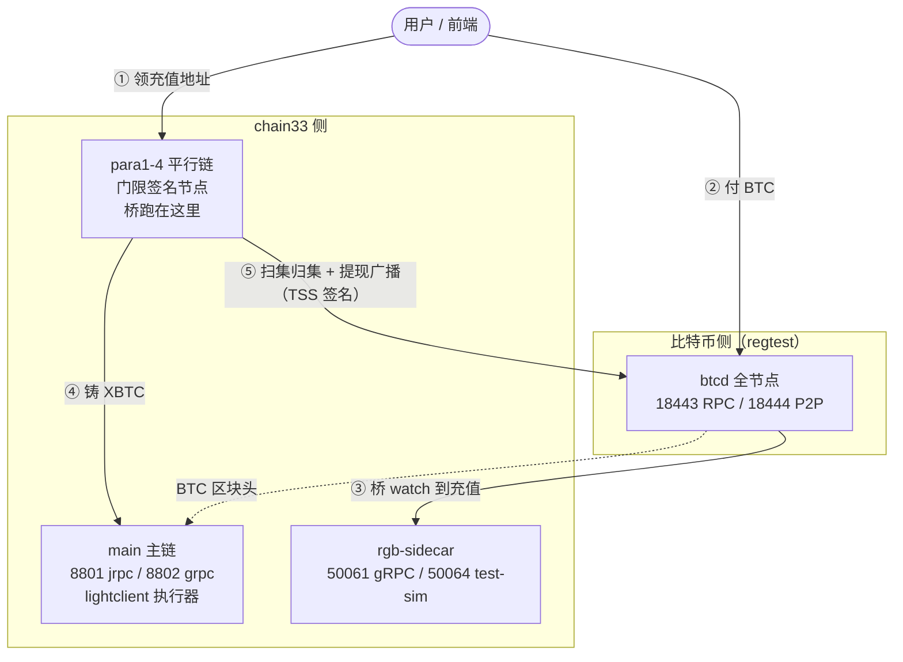

# BTC 跨链演示环境：拿到代码到跑通演示

> **代码仓库**：https://github.com/bysomeone/plugin （公开 fork，无需额外授权）
> **交付分支**：`demo/btc-crosschain`
>
> 面向需要在本地把整套 BTC 跨链系统跑起来、并对接前端的工程师。

## 一句话

**一条命令在本地拉起一整套跨链网络**，然后完整跑通“用户付 BTC → 链上到账 → 用户之间转账 → 提现回 BTC”。

比喻：相当于把交易所的出入金系统整个塞进一台笔记本 —— 比特币链是真实的一条链（regtest 模式，块自己挖），chain33 是记账那条链，中间那座桥由 4 个节点用门限签名共同掌管。

## 一、环境包含什么

| 服务 | 角色 |
|---|---|
| `main` | chain33 主链，含 lightclient 执行器（BTC 区块头共识校验） |
| `para1-4` | 4 条平行链，跨链桥与门限签名节点 |
| `btcd` | 比特币全节点（regtest） |
| `rgb-sidecar` | 桥在比特币侧的账本与交易构造 |



两个要点：

1. **桥跑在平行链上**（`para1-4` 的 `[rpc.sub.light]`），不在主链。主链只做 BTC 区块头的共识校验。
2. **每个用户一个专属充值地址**：按 `P2WSH(chain33地址, TSS群公钥)` 派生，链上按同一份派生认定归属。

## 二、跑起来

**前置条件**：Docker Desktop（建议 ≥ 8 核 / 16 GB 内存 / 20 GB 空闲磁盘）、Go 1.23。构建时会自动拉取依赖（含 `bysomeone/chain33`，同为公开仓库），无需额外配置或授权。

```bash
git clone https://github.com/bysomeone/plugin.git && cd plugin
git checkout demo/btc-crosschain

# 起环境（首次含编译，约 10–20 分钟；之后走缓存，几十秒）
make docker-compose proj=up dapp=rgbx

# 停（保留数据卷，下次原地继续）
make docker-compose-down proj=down dapp=rgbx
```

起来后 `docker compose -p rgbx ps`：`main` 与 `btcd` 应为 `healthy`，其余为 `Up`。

### 对外端口

| 服务 | 端口 | 用途 |
|---|---|---|
| main | `8801` | chain33 JSON-RPC |
| main | `8802` | chain33 gRPC |
| para1 | `17001` | **充值地址发放接口（HTTP）** |
| btcd | `18443` | 比特币 RPC（regtest；`root` / `1314`） |
| rgb-sidecar | `50061` / `50064` | 侧车 gRPC / test-sim |

## 三、演示的三条流程

### 充值：领地址 → 付 BTC → 到账

**领地址是写操作**：桥从那一刻开始 watch 这个地址。所以地址要向桥索取，不要自己推导。

```bash
# ① 领该用户的专属充值地址
curl -s "http://127.0.0.1:17001/rgbx/v1/btc-deposit-address?chain33Addr=<用户chain33地址>" | jq
# → {"data":{"address":"bcrt1q…","pkScript":"…","userID":"…","spec":"P2WSHDepositSpecV1","watchSize":1}}

# ② 用户付 BTC 到该地址（regtest 里用 btcd 造一笔即可）

# ③ 查到账
docker exec rgbx-main-1 /root/chain33-cli --conf=chain33.test.toml \
  asset balance -a "<用户地址>" --asset_exec=rgbx --asset_symbol=XBTC

# ④ 桥的闲时 ticker 会自动把这笔 BTC 归集回主池（提现花的就是主池的钱）
```

接口契约：**幂等**（同一用户重复请求返回同一地址，watch 集不增长）；缺参/非法地址 → `400`；方法不对 → `405`。

链上记账符号是 **`XBTC`**（源资产符号 `BTC`，前缀 `X` 由 `crossChainAssetPrefix` 决定）。

### 链上流转：用户之间转 XBTC

纯链上动作，不涉及 BTC 侧：

```bash
docker exec rgbx-main-1 /root/chain33-cli --conf=chain33.test.toml \
  send rgbx transfer -a <金额> -s XBTC -t <收款chain33地址> -k <私钥>
```

### 提现：链上发起 → 桥自动付款到 BTC

```bash
# ① 发起
docker exec rgbx-main-1 /root/chain33-cli --conf=chain33.test.toml \
  send rgbx withdraw -a <金额> -f <费率 sat/vB> -d <收款BTC地址> -s BTC -k <私钥>

# ② 查进度
docker exec rgbx-main-1 /root/chain33-cli --conf=chain33.test.toml \
  rgbx listPendingTx -s 0 -i 0 -c 20

# ③ 之后全自动：TSS 签名 → 广播到 BTC → 确认 → 链上销毁
```

> 符号写法：`transfer` 用 `XBTC`，`withdraw` 用 `BTC`。按各自命令抄即可。

## 四、前端要接的接口一览

| 能力 | 接口 | 等价 CLI |
|---|---|---|
| 领充值地址 | `GET`/`POST http://<para1>:17001/rgbx/v1/btc-deposit-address`，参数 `chain33Addr` | —（纯 HTTP） |
| 查余额 | chain33 jrpc `asset balance` | `chain33-cli asset balance -a <addr> --asset_exec=rgbx --asset_symbol=XBTC` |
| 查跨链信息（TSS 公钥 / 主池） | chain33 jrpc `rgbx getCrossChainInfo` | `chain33-cli rgbx getCrossChainInfo -s BTC` |
| 链上转账 | chain33 jrpc `rgbx transfer` | `chain33-cli send rgbx transfer -a … -s XBTC -t … -k …` |
| 发起提现 | chain33 jrpc `rgbx withdraw` | `chain33-cli send rgbx withdraw -a … -f … -d … -s BTC -k …` |
| 查提现进度 | chain33 jrpc `rgbx listPendingTx` | `chain33-cli rgbx listPendingTx` |

**用 jrpc 时的三步链**：`chain33-cli send …` 内部是三步，自己拼 jrpc 要照同一条链走 —— `Chain33.CreateTransaction`（`execer=rgbx`）→ `Chain33.SignRawTx`（用户私钥）→ `Chain33.SendTransaction`。

## 五、测试账号与地址

演示环境里是固定的一组 regtest 账号（**仅本地演示用**）：

| 用途 | 地址 |
|---|---|
| 演示用户（chain33 收款地址） | `14KEKbYtKKQm4wMthSK9J4La4nAiidGozt` |
| 主链账户 1–4 | `1KSBd17H7ZK8iT37aJztFB22XGwsPTdwE4` / `1JRNjdEqp4LJ5fqycUBm9ayCKSeeskgMKR` / `1NLHPEcbTWWxxU3dGUZBhayjrCHD3psX7k` / `1MCftFynyvG2F4ED5mdHYgziDxx6vDrScs` |
| BTC 提现收款地址（regtest） | `bcrt1qnnwpfpljh5n8m3a8xtf3x5ayvhjjplxmhuexyh` |
| btcd RPC | `127.0.0.1:18443`，`root` / `1314` |

签名私钥（`-k` 用）见仓库内 `plugin/dapp/rgbx/cmd/ci/HANDOFF.md` §六。**这些私钥写在公开仓库里，只适用于 regtest，不要用到 testnet / mainnet。**

充值地址**不是固定的** —— 每个用户一个，向桥索取（见 §三）。

## 六、已知限制

1. **演示范围是 BTC 跨链**：场景集覆盖充值 / 扫集 / 链上流转 / 提现 / BTC 头链护栏，不含 USDT 相关用例。
2. **regtest 演示环境**：比特币是本地私链，块要自己挖；金额与确认数都是演示口径，不是生产参数。
3. **`testSignPsbt` 在 regtest 下是打开的**（para 配置里）：该端点等于“用组私钥签任意内容”，**生产必须关**。
4. **TSS share 与侧车账本不可再生**：丢了就永久失去签名能力。演示环境可以整环境重建，但按这个架构上生产前必须先落地备份方案。

## 七、出问题先看这里

| 症状 | 先查 |
|---|---|
| `para1-4` 起来就退出 | 日志搜 `refuse to start` |
| 充值不到账 | 地址是不是向桥要的、确认数够不够、服务是否都在 |
| 提现卡住 | `rgbx listPendingTx`；`para1` 日志搜 `withdraw` |
| 余额不涨 | 符号是不是写成了 `BTC`（应为 `XBTC`） |

```bash
docker logs --tail=200 rgbx-para1-1          # 桥（跑在平行链上）
docker logs --tail=200 rgbx-main-1           # 主链 / lightclient 执行器
docker logs --tail=200 rgbx-rgb-sidecar-1    # 侧车
```

## 八、想深入看

- 仓库内 `plugin/dapp/rgbx/cmd/ci/HANDOFF.md` —— 本文档的完整版（含测试私钥、排障细节）
- 仓库内 `plugin/dapp/lightclient/rpc/lightclient/neutrino/CONFIG.md` —— 桥的配置项全表
- 仓库内 `plugin/dapp/lightclient/rpc/lightclient/neutrino/BACKUP_RECOVERY.md` —— 备份/恢复
- 本知识库 [RGB 协议与 sidecar 方案](rgb-sidecar-guide.md) —— 这套架构的背景
