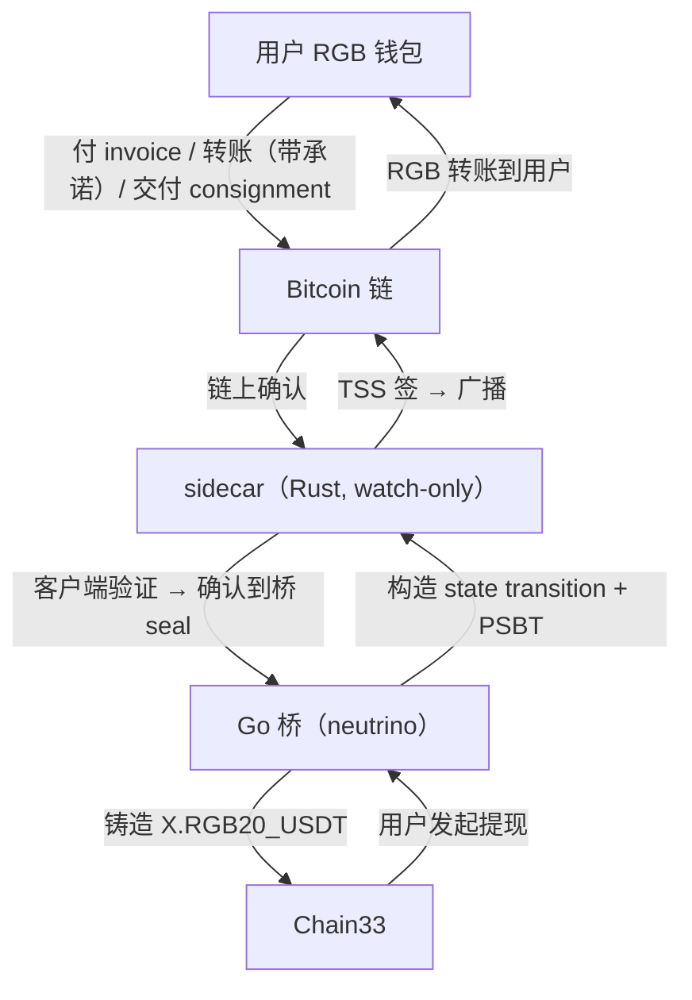

# RGB 协议与 sidecar 方案，一次讲清楚

面向已了解 Chain33 BTC 跨链桥（lightclient + rgbx + TSS）的读者，在已有跨链知识的背景下，导读 **RGB 协议到底怎么运作**、以及我们**为什么用一个 Rust sidecar **来做跨链集成。不讲全部细节，但把大方向、关键点、和最容易误解的地方讲透。

---

## 1. 一句话总结

RGB 是一种“把资产账本搬下链”的方案：**比特币链上只存一个极小的“承诺”（指纹），真正的资产账本在参与者的软件里各自维护、互相验证**。我们要做的跨链桥，本质是“**帮 Chain33 学会验证 RGB 的账本**”——而这个验证逻辑在 Rust 生态里最成熟，所以用一个 Rust 小进程（sidecar）专门干这件事。

---

## 2. RGB 协议到底是什么

### 2.1 一个常见理解：seal UTXO 确实是最核心的东西

对 RGB 的一个常见印象是“RGB 就是一个 seal UTXO”，这个印象**方向正确**。在 RGB 里，资产的“所有权”确实锚定在一个比特币 UTXO 上——这个 UTXO 叫 **seal（封印）**：

- 谁能花这个 UTXO，谁就拥有它封住的那笔资产；
- 转账 = 花掉旧的 seal，产生一个新的 seal 落在收款人那边，资产跟着“搬家”。

**但 “seal UTXO” 只是冰山一角**。RGB 真正的难点，也是和比特币完全不同的地方，在下面三点。

### 2.2 核心思想：资产账本不在链上

比特币怎么记资产？每笔转账写进区块链，所有全节点都存一份。好处公开透明，代价是链越来越重。

RGB 换了个思路：

> **资产账本 = 一份“私人的账本”，放在参与者的软件里；比特币只负责“盖章”（存一个哈希指纹），证明“账本的这次变动和某一笔链上交易是绑定的”。**

打个比方：
- 比特币是一条大马路，人人都看得见；
- RGB 资产是马路两旁**仓库里的存货**——存货账本各自保管；
- 每次存货变化，仓库主人在**马路边贴一个指纹**（哈希承诺），这个指纹和某笔链上交易绑在一起；
- 别人要看存货账对不对，需要把**账本（consignment）给他看**，他用指纹验证账本没问题。

**这就是“客户端验证（client-side validation）”**：资产真伪由参与的各方软件验证，而不是由比特币矿工验证。

### 2.3 三个关键词，讲透 RGB

| 概念 | 白话 | 技术名 |
|---|---|---|
| **seal（封印）** | 一个装着“某笔资产所有权”的比特币 UTXO；谁能花它，谁拥有资产 | single-use seal，单次使用封印 |
| **承诺（commitment）** | 贴进比特币交易里的“指纹”，绑定“账本这次怎么变”。两种贴法：OP_RETURN（**opret**，简单）或 Taproot 脚本（**tapret**，更强） | opret / tapret commitment |
| **状态转移 + consignment** | 转账时钱包生成一份“文档”：从 seal A 转 X 个币到 seal B，并跑一遍合约规则确认合法。这份文档的指纹贴到链上，文档全文（**consignment**）直接发给对方 | state transition（状态转移）、consignment（交接文书） |

### 2.4 合约与 Schema：资产不是随便发的

RGB 资产由一份**合约**定义，合约里有一个 **Schema（模板）**规定这类资产怎么运转：

- **RGB20（IFA）**：同质化代币（FT），比如 USDT——固定精度、可增发（发行者拥有增发权）；
- **UDA**：NFT；
- 等等。

每次转账，软件要**执行 Schema 里定义的逻辑**来校验（比如“转出的不能超过持有量”）。这个“执行逻辑”在一个叫 **AluVM** 的虚拟机里跑，数据用 **strict_types** 编码。这两样东西加上校验规则本身，构成 RGB 的“共识层”——**也是整件事最复杂、最难写对的部分**。

### 2.5 所以，“光看链上”为什么看不到 RGB 资产

因为资产账本根本不在链上，链上只有一个哈希指纹。**任何普通比特币浏览器上都看不到“某某地址有 1000 USDT”**。要看，必须：

1. 拿到转账的 consignment（交接文书）；
2. 用软件验证它（跑 Schema 逻辑、核对 seal 链、核对链上指纹对得上）。

**这也是对我们跨链桥最大的影响**：充值进桥的钱，光靠“看比特币区块”认不出来，必须“收到 consignment + 跑验证”才能确认。

---

## 3. 为什么需要 Rust sidecar

### 3.1 集成 RGB = 学会验证链下数据

我们现有的 BTC 桥是**链上验证**：看比特币区块、验 SPV 证明就够了。RGB 完全不同——它是**链下验证**：

- **充值**：要收到用户的 consignment，跑一遍客户端验证，确认资产真的到桥的 seal 上、金额正确；
- **提现**：要构造一份合法的状态转移（走 AluVM 执行、strict_types 编码），锚进一笔比特币交易。

这两件事就是“学会 RGB 共识”。而**共识验证是最不能写错的东西**——写错一点，就可能凭空铸造出没有实打实资产支撑的币，或把用户的钱卡住。

### 3.2 RGB 生态没有 Go 库

最现实的问题：**整个 RGB 生态的参考实现都是 Rust**（共识、虚拟机、编码全是）。Go 生态里没有现成可用的库。自己用 Go 从零写 = 约 1.5~2.5 万行，还要冒着“和官方实现不一致”的共识风险。

### 3.3 为什么不直接用现成的 RGB 程序（比如 RGB 闪电节点 RLN）？

我们认真评估过现成的 **RLN（RGB Lightning Node）**——Go 直接调它的 HTTP 接口就行，零 Rust 代码。但放弃了，三个硬伤：

1. **它自持密钥**（种子在自己手里），跟我们的“TSS 门限签名托管”冲突——资产交给它，就绕开了门限签名这道安全底线；
2. **alpha 软件**，官方声明“不对资金损失负责”；
3. **官方只支持测试网**，mainnet 的 RGB 功能要自己改代码。

### 3.4 所以：自己写一个小的 Rust sidecar

**sidecar = 一个独立的小 Rust 进程，专门负责“RGB 共识”这件事**：

- 持有**零私钥**（watch-only，只看不签）——所有签名都在我们的 TSS 门限组；
- 对 Go 桥暴露一个 **gRPC 接口**：你帮我验证这个 consignment / 帮我构造这笔提现；
- 链下把 RGB“看不懂的部分”全部消化掉，Go 桥只管编排和上链。

就像一个“翻译官”：Go 说 Chain33 的话，Rust 说 RGB 的话， sidecar 在中间做翻译和校验。

---

## 4. 一个关键约束：TSS 门限签名 → 单脚本钱包

这里是我们方案里最特别、也最容易踩坑的一点。

**我们的托管底座是 TSS 门限签名**：5 个节点凑够 3 个才能签名，资产在 TSS 门限组控制的地址上。而 **TSS 组只有一个公钥，没法派生出一堆不同的子地址**（它没有 BIP32 的 chain code）。

但 RGB 生态的库，习惯是**每笔交易生成一个新地址**（BIP32 派生）。如果 sidecar 用了这种“派生地址”，资产落在派生地址上，我们的 TSS 组**签不了**（派生子地址需要 chain code，没有）。

所以我们的 sidecar 被“逼”成一个特殊形态：**单脚本钱包**——所有地址都锁死成 TSS 那一个 P2WPKH 脚本，零派生。

> 这是整个方案的 make-or-break 点。**Spike 1 已验证通过**：`wpkh(TSS公钥)` 描述符能建出零派生的 watch-only 钱包，所有 seal 都落在 TSS 脚本上，TSS 能签。

---

## 5. 整体架构

一句话：**sidecar 在中间，把“RGB 资产如何进出”翻译成 Go 桥能理解的操作；TSS 在底下把每一次花费都门限签名。**

---

## 6. 两条核心链路

### 6.1 充值（把 RGB 资产变成 Chain33 上的资产）

1. 用户想要充值，桥发给他一个 **RGB 收款单（invoice）**（绑定某次充值请求）；
2. 用户用 RGB 钱包付这个收款单——钱从用户的 seal 转到桥的 seal；
3. 用户把 **consignment** 交给桥（上传或走 RGB 的中转服务器）；
4. sidecar **验证** consignment：跑 Schema 逻辑、核对 seal 链、核对链上指纹，确认“这笔资产真的到了桥的 seal，金额正确”；
5. 确认无误后，Go 桥在 Chain33 上**铸造等额的 X.RGB20_USDT** 给用户。

### 6.2 提现（把 Chain33 资产变回 RGB 资产）

1. 用户在 Chain33 发起提现，目标填他自己 RGB 钱包生成的 **invoice**；
2. Go 桥把提现请求交给 sidecar；
3. sidecar 构造**状态转移 + 一笔未签名的比特币交易（PSBT）**；
4. **TSS 门限组签名**这笔交易的输入；
5. 广播交易 → RGB 资产从桥的 seal 转到用户的 seal；
6. Chain33 上销毁等额的 X.RGB20_USDT。

---

## 7. 关键决策一览

| 决策 | 为什么 |
|---|---|
| 用 Rust sidecar，不自己用 Go 写 RGB | RGB 共识验证在 Rust 生态最成熟；Go 自写风险大、工作量大 |
| 不用现成 RLN | 它自持密钥（绕开 TSS）、alpha、不支持 mainnet |
| sidecar watch-only（零私钥） | 签名全部留在 TSS 门限组，安全底线不破 |
| 单脚本钱包（零派生） | TSS 只有一个公钥，派生子地址签不了（Spike 1 已验证可行） |
| 充值走 per-request invoice | RGB 收款必须预先建好 receive，且天然解决“这笔充值归谁” |
| 提现走 PSBT 外部签名 | RGB 库构造交易，TSS 签名，两边各干各的、互不干扰 |

---
