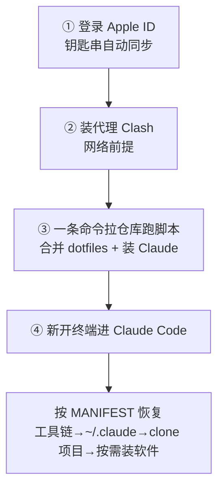

# EnvSnapshot · AI 时代的环境快照备份法

> 一句话：把整台开发机变成「一份私有 git 仓库 + 一串钥匙串 + 一段给 Claude 的引导词」，新 Mac 上让 Claude 按剧本恢复 95% 开发环境。

## 先给直觉（比喻）

传统备份像搬家把一屋子东西全搬走——重、旧、还得手动归置。EnvSnapshot 只带走三样**不可再生**的东西，家具电器（软件）到新家现买（AI 装）：

- **密钥** → 存进 iCloud Keychain（随 Apple ID 云同步，不落仓库）
- **配置** → 最小集进私有 git 仓库（只留 Claude 相关 + 启动必需）
- **软件** → 一份清单（Brewfile），AI 按需重装

像搬家只带「身份证 + 户口本 + 钥匙」，其余现场重建。

## 核心思想

传统方案的问题是「什么都备份」。而 AI 时代大部分环境**可以让 AI 重建**：软件 `brew` 装、工具配置 Claude 配、环境变量 Claude 写。**只有不可再生的才值得备份**——密钥、身份、AI 自己的配置、项目 git。

## 七条原则

1. **密钥永远不落仓库** —— 进 iCloud Keychain，随 Apple ID 同步
2. **只备份「Claude 自己搞不定的」** —— 其余全部让 AI 恢复时重建
3. **Claude 相关配置优先** —— settings/rules/agents/memory/**plans** 是最重要资产（这是别人给不了的）
4. **软件用清单不用本体** —— Brewfile（`brew bundle dump`），可复现不冗余
5. **恢复依赖有序、无交叉** —— 代理 → Claude → 配置，每步只依赖上一步
6. **分阶段安装** —— 先必要（环境能跑），其余按需（用到再装）
7. **定期同步防陈旧** —— 脚本定时刷新 + AI 定期审查本机新增项

## 恢复侧流程（新 Mac，依赖有序）

**关键**：每步只依赖上一步，无交叉依赖。代理是唯一可能需要离线素材的步骤（dmg 随身带）。

## 对比传统方案

| 维度 | 传统（整机备份 / 迁移助手） | EnvSnapshot |
|---|---|---|
| 数据量 | 几十~几百 GB | <1MB 配置 + 钥匙串 |
| 恢复时长 | 恢复镜像 + 手动重装 | 半小时~几小时（AI 引导） |
| 陈旧性 | 备份时点，越久越旧 | 定期同步 + AI 审查 |
| 密钥安全 | 明文在镜像里 | 钥匙串加密 |
| 门槛 | 迁移工具 + 对拷 | 一条命令 + Claude |

## 关键坑

1. **新 Mac 必须登录同一 Apple ID** —— 否则钥匙串不同步，全盘皆输
2. **会话历史不备份** —— 巨大又含敏感内容；有价值信息沉淀到 memory / 规则 / git
3. **AI 配置本身要备份**（`~/.claude` 全量 + plans）—— 这是不可再生资产
4. **别一次装全量软件** —— 分阶段，按需装，快且稳
5. **定期刷新** —— 否则恢复的是几个月前的旧状态；用脚本 + AI 审查双保险

## 落地清单（抽象步骤）

1. **密钥进钥匙串**：iCloud Keychain，`security add-generic-password`（service + account 命名约定，随 Apple ID 同步）
2. **建私有仓库放最小备份集**：dotfiles / AI 配置（settings/rules/agents/memory/plans）/ 软件清单（brew bundle dump）/ 代理配置
3. **写恢复剧本**：MANIFEST 引导词（给 AI 的一段话）+ bootstrap 脚本（弹性执行，失败汇总）
4. **配定期同步**：脚本定时刷新已知路径 + AI 定期审查本机新增项

## 怎么用

让 Claude Code 读取本页，即可按步骤执行备份或恢复：

1. **备份当前机**：`cd garden && claude`，然后说「按 notes/tools/env-snapshot.md 给当前开发环境做备份」
2. **恢复新机**：把 MANIFEST 引导词（一段给 AI 的话）交给新机的 Claude，它自动按清单恢复
